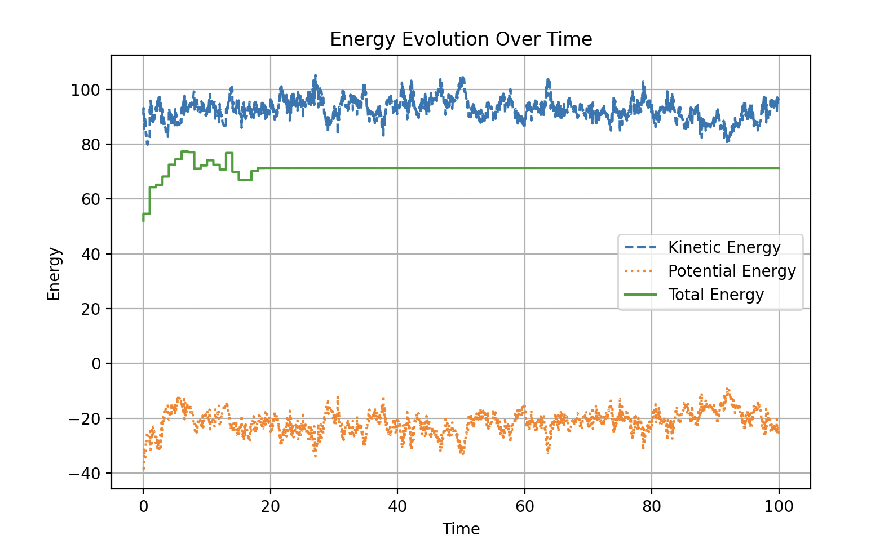
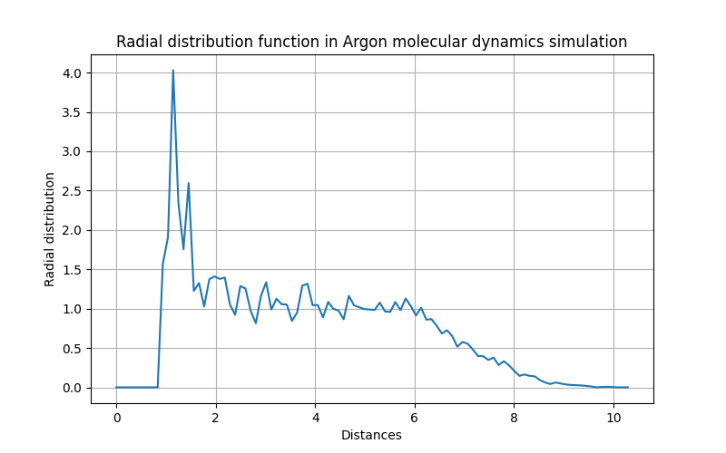

# Weekly progress journal

## Instructions

In this journal you will document your progress of the project, making use of the weekly milestones.

Every week you should 

1. write down **on the day of the lecture** a short plan of how you want to 
   reach the weekly milestones. Try to be specific: Think about how to distribute work in the group, 
   what pieces of code functionality need to be implemented, and set target deadlines.
2. write about your progress **until Tuesday, 11:00** before the next lecture with respect to the milestones.
   Substantiate your progress with links to code, pictures or test results. Reflect on the
   relation to your original plan.

We will give feedback on your progress on Tuesday before the following lecture. Consult the 
[grading scheme](https://computationalphysics.quantumtinkerer.tudelft.nl/proj1-moldyn-grading/) 
for details how the journal enters your grade.

In week 3, we ask you additionally to use the [team checklist](https://compphys.quantumtinkerer.tudelft.nl/planning_project/#team-checklist)
to reflect on how the group work is going, and how you could improve in the future.
(Note that the grade of that week does not depend on how the group functions - but we 
can give you feedback that helps you!)

Note that the file format of the journal is *markdown*. This is a flexible and easy method of 
converting text to HTML. 
Documentation of the syntax of markdown can be found 
[here](https://docs.gitlab.com/ee/user/markdown.html#gfm-extends-standard-markdown). 
You will find how to include [links](https://docs.gitlab.com/ee/user/markdown.html#links) and 
[images](https://docs.gitlab.com/ee/user/markdown.html#images) particularly
useful.

## Week 1
(due 18 February 2025, 11:00)

#### Planning

- Decide on the structure of our program 
- Understand how to store positions and velocities
- Set up GitLab and split work load for Milestones 1

#### Progress report

- Decided on the structure of our program (including parameters.py, main.py, simulation.py and animation.py file)
- Chose to store positions and velocities as 3-tensor (particle number, component, timestep), containing three spatial variables and time for each particle
- Implemented functions to derive LJ force
- Coded the function simulate() that determines the positions, velocities and total energies using Euler's Method
- Implemented periodic boundary conditions
- Coded functions to calculate relative distances and positions, taking into account periodic boundary conditions in 2D
- Implemented an animation of the system in 2D, taking into account periodic boundary conditions:

{ width=300px }
- Verified that total energy is conserved:

{ width=300px }
- Observed that for some edge cases (particles get too close together in the course of the simulation) the total energy becomes infinite and the simulation breaks down   
  (Action item for next week: understand the reason for this and adapt the code accordingly)
- Some issues still need to be solved: for now we have settled different parameters to 1 (sigma, m, epsilon), but this could be a cause for the edge cases mentioned before. A proper treatment of these parameters needs to be considered.
- Second issue relates to the animation plot: while some members of the group can visualise the animation in their computer, others cannot. 

## Week 2
(due 25 February 2025, 11:00)

#### Planning
- Add pip list with required libraries (Tim)
- Change box_dimension parameter from L/2 to L (Tim)
- Derive the expression of the kinetic energy in dimensionless units (Cesar)
- Implement dimensionsless units (Cesar & Arturo)
- Plot energies and interatomic distances with respect to dimensionless time (Cesar)
- Do testing of edge cases by revisiting simulation workflow (initialization, force calculation, etc.) (Tim)
- Implement minimal image convention efficiently, ideally using provided formula (Arturo)
- Simulate 2 atoms in 3D space and plot inter-atom distance over time (everyone)
- Test simulation for multiple particles (Tim)
- write report (everyone)
- (if time permits) write function to convert dimensionless units to SI units for late use (everyone)

#### Progress report

- Derived expression for kinetic energy in dimensionless units and implemented it [here.](https://gitlab.kwant-project.org/computational_physics/projects/Project1_Arturo_chernandodelaf_tneumann/-/blob/master/simulation.py?ref_type=heads#L211)
- Adapted our previous simulation to now incorporate dimensionless units. In particular, these are the additional dimensionless quantities we have transformed:

  -- [forces](https://gitlab.kwant-project.org/computational_physics/projects/Project1_Arturo_chernandodelaf_tneumann/-/blob/master/simulation.py?ref_type=heads#L178-190)
  -- [potential energy](https://gitlab.kwant-project.org/computational_physics/projects/Project1_Arturo_chernandodelaf_tneumann/-/blob/master/simulation.py?ref_type=heads#L231-237)
  -- [velocities and positions (pt.1)](https://gitlab.kwant-project.org/computational_physics/projects/Project1_Arturo_chernandodelaf_tneumann/-/blob/master/simulation.py?ref_type=heads#L52-59)
  -- [velocities and positions (pt.2)](https://gitlab.kwant-project.org/computational_physics/projects/Project1_Arturo_chernandodelaf_tneumann/-/blob/master/simulation.py?ref_type=heads#L240-286)
- Implemented a function to convert magnitudes from dimensionless units to SI units [here.](https://gitlab.kwant-project.org/computational_physics/projects/Project1_Arturo_chernandodelaf_tneumann/-/blob/master/units_conversion.py) and defined respective parameters in SI units [here](https://gitlab.kwant-project.org/computational_physics/projects/Project1_Arturo_chernandodelaf_tneumann/-/blob/master/units_conversion.py#L21-26) for future reference.
- Optimized [minimal image convention](https://gitlab.kwant-project.org/computational_physics/projects/Project1_Arturo_chernandodelaf_tneumann/-/blob/master/simulation.py?ref_type=heads#L141) by avoiding loops and leveraging numpy vectorization in one line of code, according to the formula $pos_{2,new} = pos_2+((pos_1-pos_2+(box_{dim}/2))//(box_{dim}))*(box_{dim})$, which we derived as described in the accompanying [comment.](https://gitlab.kwant-project.org/computational_physics/projects/Project1_Arturo_chernandodelaf_tneumann/-/blob/master/simulation.py?ref_type=heads#L142-144) 
- Implemented velocity initialization according to a normal distribution and recentered the sample [here.](https://gitlab.kwant-project.org/computational_physics/projects/Project1_Arturo_chernandodelaf_tneumann/-/blob/master/simulation.py?ref_type=heads#L262-286)
- Adapted code to perform simulation in $3$D instead of $2$D, cf. for example [here.](https://gitlab.kwant-project.org/computational_physics/projects/Project1_Arturo_chernandodelaf_tneumann/-/blob/master/simulation.py?ref_type=heads#L58)
- Implemented animation for $3$D dimulation. It is possible to show the $27$ boxes (copies) with parameters.boundary_representation=True. If this value is False, only the central box is shown, as can be seen [here.](https://gitlab.kwant-project.org/computational_physics/projects/Project1_Arturo_chernandodelaf_tneumann/-/blob/master/animation.py?ref_type=heads#L72)
- Adapted code to have a box of length box_dimension (L) instead of $2\cdot$box_dimension (2L).
- Created plotting routine for kinetic and potential energies [here.](https://gitlab.kwant-project.org/computational_physics/projects/Project1_Arturo_chernandodelaf_tneumann/-/blob/master/plots.py?ref_type=heads#8-39) 
- Implemented plotting for relative distance between 2 atoms [here.](https://gitlab.kwant-project.org/computational_physics/projects/Project1_Arturo_chernandodelaf_tneumann/-/blob/master/plots.py?ref_type=heads#41-54) 
- Added [requirements.txt]( https://gitlab.kwant-project.org/computational_physics/projects/Project1_Arturo_chernandodelaf_tneumann/-/blob/master/requirements.txt?ref_type=heads) file for replicability

Notes/Issues:
- Tested simulation for multiple particles and found that stability of simulation is strongly depended on initial conditions
- Many simulations "collapse" (nan values) after some time. We tested for many reasons, including revisiting the force calculation in all three dimensions. We occasionally obtain expected behaviour. Currently, we suspect that the Euler update rule is the cause of this. For next week, we plan to implement Verlet's method asap in order to verify this hypothesis (or revisit force calculation once more if undesired behavior persists)
- While we optimized the minimum image convention, some other loops still need optimization, e.g. the [force calculation.](https://gitlab.kwant-project.org/computational_physics/projects/Project1_Arturo_chernandodelaf_tneumann/-/blob/master/simulation.py?ref_type=heads#L182-190) We also need to check the optimized [potential calculation.](https://gitlab.kwant-project.org/computational_physics/projects/Project1_Arturo_chernandodelaf_tneumann/-/blob/master/simulation.py?ref_type=heads#L231-237.)
- We plan to devote more time to making the animation in $3$D more user-friendly.

Summary of work:
We achieved all planning tools (incl. the optional ones) that we set out in the planning for week $2$. Additionally, we identified some issues that need further attention next week.

## Plots

- Plot of the energies:

 { width=300px }

- Plot of the inter-particle distances: 

{ width=300px }

- 3D plot (central box):

 { width=300px }

- 3D plot (27 boxes):

 { width=300px }

- 3D plot (5 particles): 

{ width=300px }

## Week 3
(due 4 March 2025, 11:00)

#### Planning

- Extend the code to more than 2 particles. (We already did that.)
- Implement the velocity-Verlet algorithm. (Arturo)
- Investigate the conservation of energy in the system after the implementation of velocity-Verlet. Plot the evolution of the kinetic and potential energy, as well as their sum. (Tim)
- Optimizing force and check potential calculation (Tim)
- Determine optimal time step to use (everyone)
- Compare the results of energy conservation using the Euler and Verlet algorithms (Cesar)
- verify velocity initialization (Cesar)
- Work on debugging potential errors and structuring code, including adding comments (everyone)

#### Progress report

- The given code simulates a system of N particles (N should be chosen in agreement with a given fcc lattice structure in which we initialize).
- All functions in [simulation.py](https://gitlab.kwant-project.org/computational_physics/projects/Project1_Arturo_chernandodelaf_tneumann/-/blob/master/simulation.py?ref_type=heads) are commented with functionality, input and output (including data types), and additional explanations for non-trivial transformations and operations.
- Verlet's algorithm is implemented in lines [98-129](https://gitlab.kwant-project.org/computational_physics/projects/Project1_Arturo_chernandodelaf_tneumann/-/blob/master/simulation.py?ref_type=heads#L98-129)
- The conservation of the total energy is verified. Both the kinetical and potential energy are plotted in time, as well as their sum. To verify this you need to settle rescaling=False in parameters.py to not apply any rescaling. [scaling_parameter](https://gitlab.kwant-project.org/computational_physics/projects/Project1_Arturo_chernandodelaf_tneumann/-/blob/master/parameters.py?ref_type=heads#L15) (If rescaling is flagged as True, conservation of energy is achieved as soon as the rescaling phase ends.)
- We compared Euler's and Verlet's method to find that Verlet's method is more accurate and does not blow up. In particular, energy conservation is achieved for Verlet's method, whereas Euler's method does not conserve energy and is heavily dependent on the initialization of atoms.
- The code has been optimised to avoid the use of loops in the computation of the [relative positions](https://gitlab.kwant-project.org/computational_physics/projects/Project1_Arturo_chernandodelaf_tneumann/-/blob/master/simulation.py?ref_type=heads#L171), the [relative distances](https://gitlab.kwant-project.org/computational_physics/projects/Project1_Arturo_chernandodelaf_tneumann/-/blob/master/simulation.py?ref_type=heads#L174) and the [forces](https://gitlab.kwant-project.org/computational_physics/projects/Project1_Arturo_chernandodelaf_tneumann/-/blob/master/simulation.py?ref_type=heads#L206-222). A detailed description of how numpy vectorization on tensors is used in this optimization can be found in the comments of the linked functions.
- Positions are initialised according to the fcc lattice distribution in the lines [269-321](https://gitlab.kwant-project.org/computational_physics/projects/Project1_Arturo_chernandodelaf_tneumann/-/blob/master/simulation.py?ref_type=heads#L269-321). A theoretical derivation of how to parametrize the positions in a FCC can be found in [theoretical derivation](reports/Journal_Week3.pdf)). The fcc lattice is shrunk (factor 0.9 in line [319](https://gitlab.kwant-project.org/computational_physics/projects/Project1_Arturo_chernandodelaf_tneumann/-/blob/master/simulation.py?ref_type=heads#L319)) to avoid conflicts with the minimal image convention.
- Velocities are initialised following the normalised Maxwell-Boltzmann distribution, with normalised velocities and temperature (for a theoretical derivation, please refer to the .pdf here: https://gitlab.kwant-project.org/computational_physics/projects/Project1_Arturo_chernandodelaf_tneumann/-/blob/master/reports/Journal_Week3.pdf)
- Temperatures (as a first observable of interest) are [computed](https://gitlab.kwant-project.org/computational_physics/projects/Project1_Arturo_chernandodelaf_tneumann/-/blob/master/simulation.py?ref_type=heads#L352-354) (see the [theoretical derivation](reports/Journal_Week3.pdf)) and [plotted](https://gitlab.kwant-project.org/computational_physics/projects/Project1_Arturo_chernandodelaf_tneumann/-/blob/master/plots.py?ref_type=heads#L86-99).
- Rescaling of the velocities implemented to adapt to a specific temperature, in lines [356-363](https://gitlab.kwant-project.org/computational_physics/projects/Project1_Arturo_chernandodelaf_tneumann/-/blob/master/simulation.py?ref_type=heads#L356-363). See the [theoretical derivation](reports/Journal_Week3.pdf).
- The code is structured in a [main.py file](https://gitlab.kwant-project.org/computational_physics/projects/Project1_Arturo_chernandodelaf_tneumann/-/blob/master/main.py?ref_type=heads) file which orchestrates the execution of the simulation. It retrieves parameters from the [parameters.py file](https://gitlab.kwant-project.org/computational_physics/projects/Project1_Arturo_chernandodelaf_tneumann/-/blob/master/parameters.py?ref_type=heads) and triggers the simulation by calling the [simulation.py file](https://gitlab.kwant-project.org/computational_physics/projects/Project1_Arturo_chernandodelaf_tneumann/-/blob/master/simulation.py?ref_type=heads), which returns the observables of interest. Lastly, it creates a visualization and various plots by calling the [animation.py](https://gitlab.kwant-project.org/computational_physics/projects/Project1_Arturo_chernandodelaf_tneumann/-/blob/master/animation.py?ref_type=heads) and [plots.py files](https://gitlab.kwant-project.org/computational_physics/projects/Project1_Arturo_chernandodelaf_tneumann/-/blob/master/plots.py?ref_type=heads). 
- [Hyperparameters of the simulation](https://gitlab.kwant-project.org/computational_physics/projects/Project1_Arturo_chernandodelaf_tneumann/-/blob/master/parameters.py?ref_type=heads) such as the simulation time step, the number of time steps in the simulation, the rescaling period and duration as well as the lattice constant are chosen motivated by Thijsen.

In conclusion, we have working and well-documented code that initializes fcc positions and Boltzmann-distributed velocities and simulates the equations of (classical) motion of N particles according to Lennard-Jones forces, respecting periodic boundary conditions. Our simulation conserves energy, applies rescaling to emulate an equilibration phase, and extracts temperature as first observable of interest.

#### Plots

- Plot of the energies:

 { width=300px }

 { width=300px }

 { width=300px }

- Plot of the temperatures: 

{ width=300px }

{ width=300px }

{ width=300px }

- 3D plot (central box):

 { width=300px }

- FCC Initialisation (various angles):

 { width=300px }

 { width=300px }

 { width=300px }

 { width=300px }

- Energies comparison between the Euler and Verlet methods:

{ width=300px }

{ width=300px }

#### Reflection on group work

The weekly planning and reflection sessions have been very helpful to split and structure our work. We have contributed equally to the project so far, which is also reflected in consistent commits of all team members.
Referring to the team checklist, all members of the group answered all cells of the matrix with 'yes'.

## Week 4
(due 11 March 2025, 11:0)

#### Planning

Milestones for this week:

- Implement the initialization of positions onto an fcc lattice. Account for periodic boundary conditions by removing one site layer in each dimension (everyone). (Decide on final number of atoms; increase number of particles in accordance with the fcc lattice)
- Show that the initial velocities obey a Maxwell-Boltzmann distribution (Already did that; link theoretical derivation). Attach plots of component velocities to verify Gaussian. (Tim)
- Perform the rescaling of temperature and show how the desired temperature is attained after a certain amount of rescaling and equilibrating. (Already did that (mostly)) Add small
    analysis that desired temperature is actually attained/restored (add error threshold and potentially adjust equilibration time)
- Study observables and compare (Adapt observable calculation to only take into account the time after equilibration):
-- Pair correlation function to identify phase transitions (Tim)
-- Diffusion (Cesar)
-- specific heat, compare phases (Arturo)
-- (Pressure, compare to Verlet)
- (study simulation time using profiler)
- (display simulation parameters (number of particles, density) and/or observables (incl. velocity component distributions) in simulation / create dashboard)
- (implement error calculation for observables)

#### Progress report

MILESTONES

- Implement the initialization of positions onto an fcc lattice, and in particular implemented periodic boundary conditions after fcc lattice initialization. For a lattice constant of box_dimension/3, this gives 108 particles in the initialization.
- Initialized velocities according to a Maxwell-Boltzmann distribution. Added plots to visualize initial distribution of velocities. We see that this works properly, but even with $108$ particles there is still too much random noise to obtain a nice Gaussian graphically (we will update this plot in the final simulation, where we use more particles). The individual Gaussian components are implemented [here.](https://gitlab.kwant-project.org/computational_physics/projects/Project1_Arturo_chernandodelaf_tneumann/-/blob/master/simulation.py?ref_type=heads#L350-357)
- Performed the rescaling of temperature and showed how the desired temperature is attained after a certain amount of rescaling and equilibrating. (see last week, where one can see that the equlibrated temperature variies around the desired (dimensionless) temperature $1$)
- Implemented the [pair correlation function](https://gitlab.kwant-project.org/computational_physics/projects/Project1_Arturo_chernandodelaf_tneumann/-/blob/master/simulation.py?ref_type=heads#L469-519) and tested its behavior on the fcc lattice and final configuration of a typical simulation. For the fcc initialization, we obtain sharp peaks as expected from a 
rigid lattice structure. For the final state of our simulation (15000 time steps in this case), there is an initial peak and a relatively smeared out tail, which also matches our expectation. In following weeks,
we can focus on how to extract information regarding the pair correlation for inference of phase transitions. Note that the maximum distance between particles is a little larger than $10$ according to our plots. This 
can be verified by computing the maximal theoretical distance between particles in the box (respecting periodic BC) as $\sqrt{3*(\frac{\text{boxdim}}{2})^2} = \sqrt{\frac{3}{4}*12^2} = 10.39$ for our particular box dimensions. Comparing the plot (see below) with the one provided in Figure 7.1 in Thijssen, we obtain a similar result qualitatively. We expect that adding  more particles will smooth the tail.
- Implemented the [diffusion function](https://gitlab.kwant-project.org/computational_physics/projects/Project1_Arturo_chernandodelaf_tneumann/-/blob/master/simulation.py?ref_type=heads#L522-569), which calculates the mean squared displacement. For this, we consider as the initial referece time a fourth of the total simulation time, since at that time the energy is conserved and the system has reached equilibrium. We observe that the mean squared displacement fluctuates with time. It has a time average of roughly $36*\sigma$. For the next week, we will increase the simulation time and the number of particles and analyse deeply if the mean squared displacement grows linearly at long times as happens with liquids. Additionally, when taking as initial reference time 0, we see that the mean squared displacement decreases initially. However, it should increase quadratically initially (does not matter if the system behaves like a solid, liquid or gas).
- Implemented [calculation](https://gitlab.kwant-project.org/computational_physics/projects/Project1_Arturo_chernandodelaf_tneumann/-/blob/master/simulation.py?ref_type=heads#L571-618) and [visualisation](https://gitlab.kwant-project.org/computational_physics/projects/Project1_Arturo_chernandodelaf_tneumann/-/blob/master/plots.py?ref_type=heads#L152-181) of the Total Specific Heat and the Specific Heat per particle. To compute the total specific heat, the formula $C_V=\left[\frac{2}{3N}+1-\frac{\langle K^2\rangle}{\langle K\rangle ^2}\right]^{-1}$, which can be easily obtained from the expression $\frac{\langle \delta K^2\rangle}{\langle K\rangle ^2}=\frac{\langle K^2\rangle}{\langle K\rangle ^2}=\frac{2}{3N}-\frac{1}{C_V}$. The averages are computed using $\langle A\rangle =\frac{1}{n-n_0}\sum_{\nu=n_0+1}^{n}A_\nu$. 

PLOTS

- Initial distribution of velocities per coordinate (for $108$ particles)

 { width=400px }

- Pair correlation observable

-- Pair correlation initial fcc with 32 atoms (first peak at distance $\sqrt{3^2+3^2} = 4.243$)

 { width=300px }

-- Pair correlation initial fcc with 108 atoms

{ width=300px }

-- Pair correlation at the end of simulation (108 atoms, 15000 time steps)

{ width=300px }

- Diffusion (mean square displacement) observable

-- Using as initial reference time a fourth of the total simulation time (108 atoms, 15000 time steps):

{ width=300px }

-- Specific heats for 108 atoms:

{ width=300px }

## Week 5
(due 18 March 2025, 11:00)

#### Planning

- Read paper on correlated Gaussians (Tim)
- Implement calculation of errors and test your implementation on data with a known correlation time, using autocorrelation and data blocking method (César, Arturo)
- Compute observables including errors: kinetic, potential energy, diffusion with correlation function, heat capacity with data blocking/bootstrapping, pairwise correlation function (determine what error we need to detect here) (everyone)
- Extract pair correlation function at triple point, and devise method to extract phase information from pair correlation (Tim)
- Read about how to analyse phases of matter and phase transitions, with emphasis on diffusion (Cesar)
- Code structure: create new file that includes data processing functions (everyone)
- Implement velocity comparison (Tim)
- Adapt temperature rescaling (Arturo)
- Make plan for report, incl. observables, simulation parameters etc. (everyone)
- Test performance and speed of simulation (Tim)
- (Implement pressure)
- (Work on code structure)

#### Progress report

MILESTONES
- Added Gaussian comparison to [velocity plots.](https://gitlab.kwant-project.org/computational_physics/projects/Project1_Arturo_chernandodelaf_tneumann/-/blob/master/plots.py?ref_type=heads#L52-71)
- Implemented Bootstrapping error estimation for diffusion and [heat capacity.](https://gitlab.kwant-project.org/computational_physics/projects/Project1_Arturo_chernandodelaf_tneumann/-/blob/master/data_processing.py?ref_type=heads#L247-328)
- Updated [pair correlation](https://gitlab.kwant-project.org/computational_physics/projects/Project1_Arturo_chernandodelaf_tneumann/-/blob/master/simulation.py?ref_type=heads#L471-519) function to account for time averages and extracted phase information depending on temperature and density; see plots. Note: This is not the final version, since the density is hard-coded after the initialization currently, which is not desired behaviour (the results are qualitatively, but not quantitatively correct), but serves as a pragmatic proof of concept that the pair correlation function itself works properly.
- Structured code in a systematic way by creating a new file for data processing and error analysis
- Updated rescaling to apply it once the temperature is 5% above or below the desired temperature, as seen in line [148 (simulation.py)](https://gitlab.kwant-project.org/computational_physics/projects/Project1_Arturo_chernandodelaf_tneumann/-/blob/master/simulation.py?ref_type=heads#L148).
- Implemented [Data Blocking](https://gitlab.kwant-project.org/computational_physics/projects/Project1_Arturo_chernandodelaf_tneumann/-/blob/master/simulation.py?ref_type=heads#L132-213) to obtain an estimation of the standard deviation. To see if the standard deviation has converged, we consider packages of values of b and compute their mean. For each package, we compute the difference of their means (in absolute value) between adjacent packages and add those differences. 
The package that has the lowest difference with their adjacent packages is to considered to be the "converged" value. However, this method is unbalanced towards low value of the block size b, so we apply a weight given by the expression $2\cos(\frac{2\pi*index}{number of packages})+3$, to prioritise values in the centre of the block sizes (This is not an ideal method and it has heavy flaws. Other methods to determine the convergence of the standard deviation will be tested.)
- Implement a function [autocorrelation_analysis](https://gitlab.kwant-project.org/computational_physics/projects/Project1_Arturo_chernandodelaf_tneumann/-/blob/master/data_processing.py?ref_type=heads#L12-88) to calculate the autocorrelation of a given observable, and by fitting to an exponential in a time range, obtain the correlation time. Finally, the function calculates the error of the observable.
- Validate [autocorrelation_analysis](https://gitlab.kwant-project.org/computational_physics/projects/Project1_Arturo_chernandodelaf_tneumann/-/blob/master/data_analysis.py?ref_type=heads#L12-88) with randomly generated data [normal_autocorr](https://gitlab.kwant-project.org/computational_physics/projects/Project1_Arturo_chernandodelaf_tneumann/-/blob/master/data_processing.py?ref_type=heads#L91-129). We observe that the autocorrelation fits well to a negative exponential and when imposing a correlation time of 50, we obtain a estimated correlation time of 60, which is reasonable. - 
- Calculate error of kinetic energy and potential energy using the autocorrelation method [main.py](https://gitlab.kwant-project.org/computational_physics/projects/Project1_Arturo_chernandodelaf_tneumann/-/blob/master/data_processing.py?ref_type=heads#L103-110). We obtain the following averages and errors: kinetic energy = 178.2 +- 0.5    and      potential energy = -55.8 +- 0.5 (agrees with the error obtained with data blocking).
  

Sample error estimate (using two different methods to calculate the error):

The value of the Total Specific Heat with error computed using Bootstrap at the end of the simulation is: 179.04403075281365 +- 0.5042345029688272.

The value of the Total Specific Heat with error computed using Data Blocking at the end of the simulation is: 179.04403075281365 +- 0.21649437034638538.

We plan to verify our solution by ...
- ... comparing the state of the system derived from the pair correlation function at a certain temperature with literature
- ... inspect the animation

PLOTS

- Initial distribution of velocities per coordinate (for $108$ particles)

 { width=400px }

- Pair correlation for different phases of the system

1. Gas: T=3, rho=0.3

 .png){ width=400px }

2. Liquid: T=1, rho=1

 .png){ width=400px }

3. Solid (needs revision): T=0.5, rho=1.2

 .png){ width=400px }

- Validation of autocorrelation function with randomly sampled data with correlation time = 50

{ width=400px }

- Autocorrelation of kinetic energy

{ width=400px }

- Autocorrelation of potential energy

{ width=400px }

PLAN FOR FINAL REPORT
- Observables: kinetic and potential energy, pair correlation (incl. analysis of phase), specific heat, diffusion
- demonstrate periodic boundary conditions
- visualize code performance (scaling)

TO-DO:
- revisit documentation and comments
- update fcc initialization in order to control density directly
- extract phase information systematically
- Test performance once fcc initialization is updated. Currently, we can run ~150 atoms for 10000 time steps easily. Since we vectorized everything, we expect to be able to scale up to our target
atom number of ~250 atoms without much modification. We aimed to minimise the use of inefficiences (as the loop for) as much as possible. However, at this point, our focus should be to improve the scientifical accuracy of our model rather than in the efficiency of our code. 

## Reminder final deadline

The deadline for project 1 is **25 March, 23:59**. By then, you must have uploaded the report to the repository, and the repository must contain the latest version of the code.
